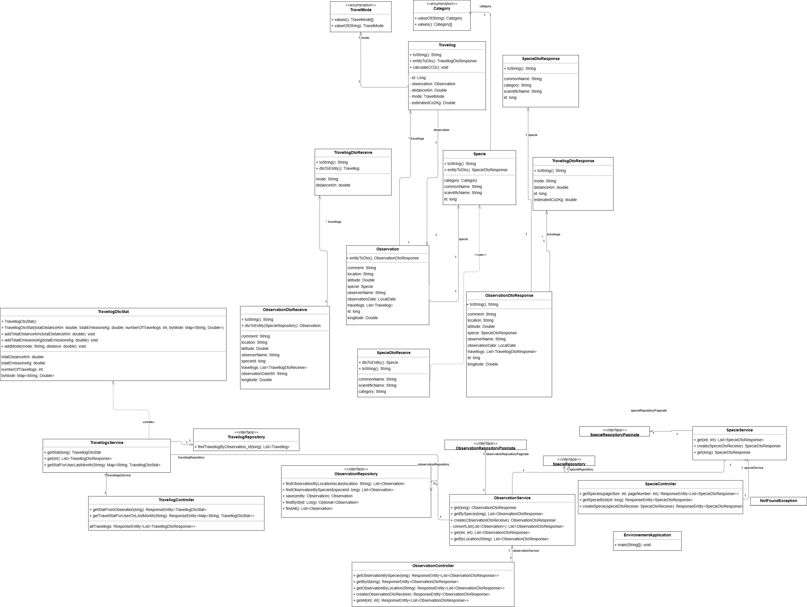
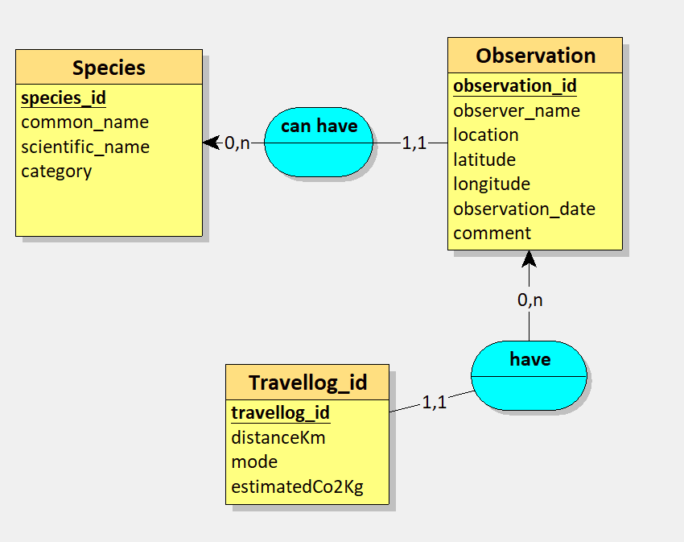
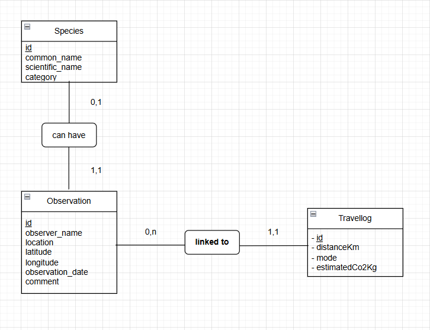

# Sujet ECF 1 – CDA : Application Observations Nature

## Contexte
Cette application Java permet de **signaler et visualiser des observations d’espèces** dans la nature.  
Le projet est partiellement développé. Votre mission consiste à **compléter la modélisation UML, certaines classes Java et la logique métier**, notamment le calcul des émissions de CO₂.

---

## 1. Objectifs
- Compléter le **diagramme UML** et le **MLD** à partir des spécifications fournies.
- Compléter les classes Java manquantes ou incomplètes pour assurer le bon fonctionnement.
- Vérifier et compléter la logique métier, notamment le **calcul des émissions de CO₂**.

---

## 2. Pré-requis techniques
- **Java**
- **Maven**
- **MySQL** (base `environement_db`)
    - Utilisateur : `root`
    - Mot de passe : défini dans `.env`
- Outil UML pour compléter les fichiers fournis.

**Fichiers UML et MLD** : à la racine du dépôt

---

## 3. Partie modélisation
- Compléter le **diagramme de classes UML** partiellement rempli.
- Compléter le **MLD (Modèle Logique de Données)** :
    - Types
    - Relations
    - Cardinalités

**Images de modélisation :**  
  
  


---

## 4. Partie développement
- Compléter les classes manquantes selon les spécifications.
- Compléter les **endpoints REST** inachevés.
- Assurer le calcul correct du **CO₂ pour les déplacements**.

---

## 5. Spécifications fonctionnelles

### Entités

#### Specie
| Champ | Type |
|-------|------|
| id | Long |
| commonName | String |
| scientificName | String |
| category | Category (enum) |

```java
public enum Category {
    BIRD, MAMMAL, INSECT, PLANT, OTHER
}
